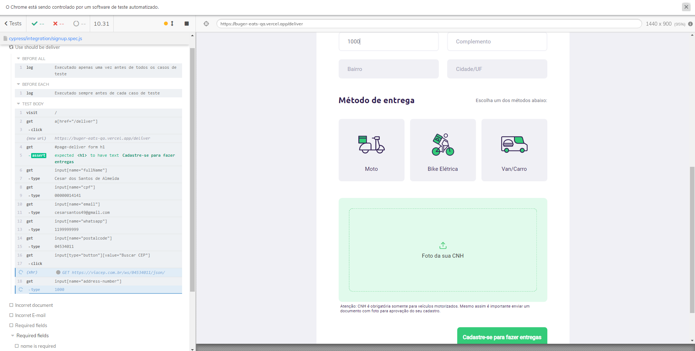

<h1 align="center"> Teste automatizado com Cypress </h1>

<p align="center">
    
</p>


## Descrição

O projeto é uma API RESTful aonde é possível cadastrar, alterar, ler e excluir usuários. Interface de Programação de Aplicações (português) cuja sigla API provém do Inglês Application Programming Interface, é um conjunto de rotinas e padrões estabelecidos por um software para a utilização das suas funcionalidades. 

API conta com 5 funcionalidades básicas: obter todos os registros, selecionar um único registro, cadastrar, atualizar e deletar. Até o momento não foi implementado um sistema de autenticação para utilizar a API, possibilitando assim a utilização pública da mesma. 

Para isso foi utilizado o Node junto com o Express.js para realizar o roteamento das rotas da API que obtém os dados do mongodb atlas. A arquitetura é baseada no MVC e também foi trabalhado algumas regras de negócio internamente. Na pasta DOC você encontra alguns registros prontos para efetuar teste na aplicação.


## Instalação Local

Para executar esse projeto você precisara do [Node](https://nodejs.org/en/).

Por meio dele sera baixado todas as depedencias do projeto, depois de instalado execute os comandos abaixo na linha do terminal.

1) para baixa todas as dependencias do projeto

```bash  
npm install
```

2) Execute o comando abaixo no terminal
```bash 
npm run test
```

5) Acesse "http://localhost:PORTA/ (substititua PORTA pelo o valor definido no .env)


## Status do Projeto

**Concluido**: O projeto esta terminado, não havera futuras alterações de funcionalidade.


## Construído com

* [Node](https://nodejs.org/en/) - Node.js é um software de código aberto, multiplataforma, baseado no interpretador V8 do Google e que permite a execução de códigos JavaScript fora de um navegador web.

* [Cypress.io](https://www.cypress.io/) - O Cypress.io é um framework de testes automatizados end-to-end usando JavaScript! Mas não vai achando que é mais um framework "modinha" que surgiu por ai, ele me surpreendeu de maneira bastante positiva por suas características e principalmente pelo seu mecanismo.

* [cypress-file-upload](https://github.com/abramenal/cypress-file-upload) - Este pacote adiciona um comando Cypress personalizado que permite que você faça uma abstração sobre como exatamente você carrega arquivos por meio de controles HTML e se concentra em testar os fluxos de trabalho do usuário.

* [JSON](https://www.json.org/json-en.html) - Em computação, JSON, um acrônimo de JavaScript Object Notation, é um formato compacto, de padrão aberto independente, de troca de dados simples e rápida entre sistemas, especificado por Douglas Crockford em 2000, que utiliza texto legível a humanos, no formato atributo-valor. 

## Versão das Linguagens e Ferramentas

#### Geral

* Cypress.io - 9.5.1
* cypress-file-upload - 5.0.8


## Autor

* **Cesar dos Santos de Almeida** - *responsável pela construção e desenvolvimento do projeto*

## Licença

Este projeto está licenciado sob a licença MIT - consulte o arquivo [LICENSE.md](LICENSE.md) para obter detalhes


## Links

* [QANinja](https://app.qaninja.com.br/area/vitrine) - Link do curso que ensinou essas habilidades


